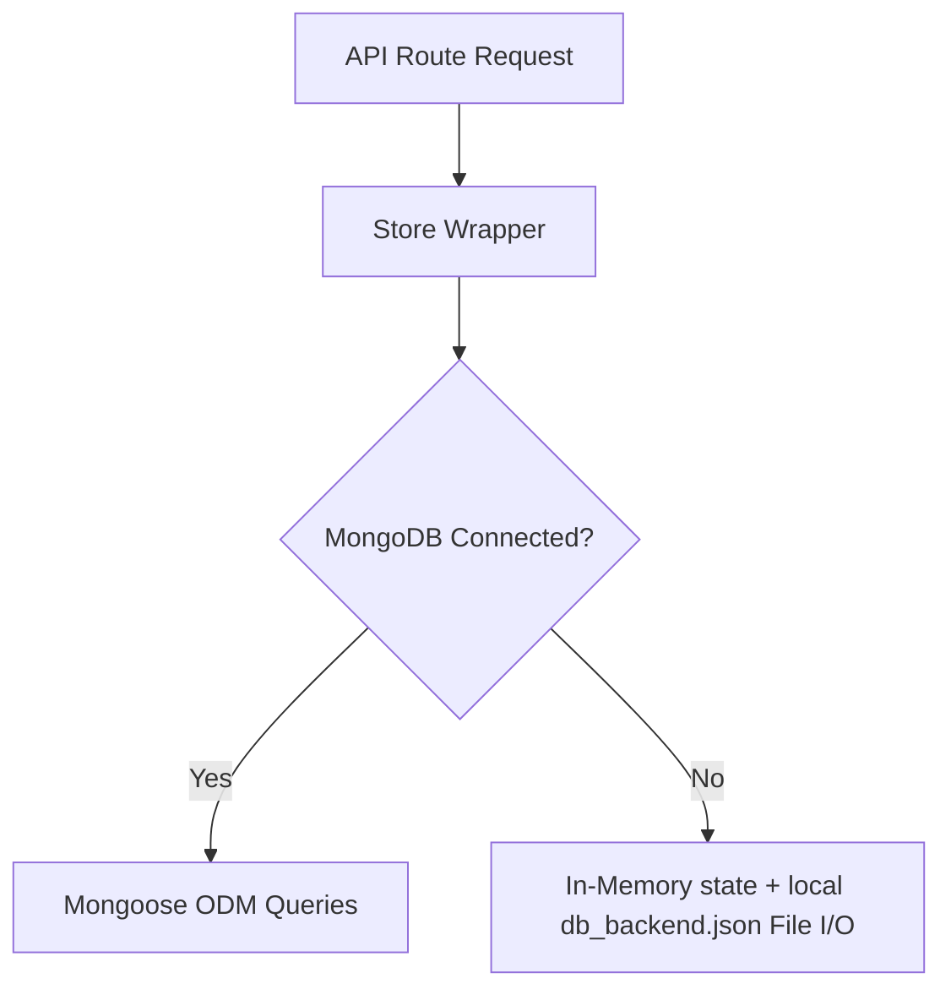
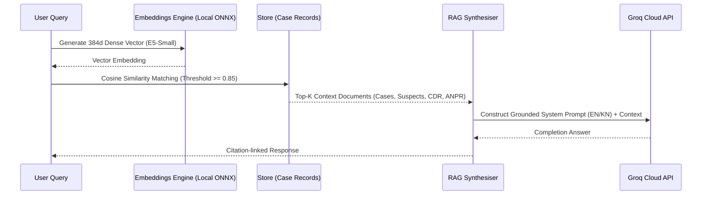

# NyayaNetra | Backend System Architecture Guide

Welcome to the **NyayaNetra** backend developer guide. This document explains the codebase design, data flows, database abstractions, and deployment pipelines. It is structured to help new developers get up to speed in minutes.

---

## 📁 Codebase Directory Structure

The project separates the frontend web interface and the serverless-ready Node.js backend:

```
nyayanetra/
├── backend/                  # Canonical modular Express backend application
│   ├── utils/
│   │   └── embeddings.cjs    # ONNX runtime local text embedding engine
│   ├── app.cjs               # Main Express application initialization & middlewares
│   ├── models.cjs            # Mongoose schemas & ODM database models
│   ├── store.cjs             # Unified database storage layer (MongoDB / JSON Fallback)
│   ├── rag.cjs               # Multilingual semantic search & RAG query synthesiser
│   └── routes.cjs            # REST API endpoint routes & Switchboard console router
├── functions/                # Zoho Catalyst serverless function targets
│   └── api/                  # The Express serverless wrapper deployment package
│       ├── backend/          # Synchronised copy of the backend/ directory (predeployed)
│       ├── server.cjs        # Synchronised copy of the server entry point (predeployed)
│       └── index.js          # Zoho Catalyst entry point (exports express app)
├── scripts/                  # Seed scripts & automated smoke testing suites
├── src/                      # Frontend client application code (Vite + React)
├── server.cjs                # Project root entry point (delegates execution to backend/app.cjs)
├── db_backend.json           # Local database file (auto-generated fallback)
└── catalyst.json             # Zoho Catalyst workspace project configuration
```

---

## 💾 Database Layer: The Hybrid Store

NyayaNetra uses a **Hybrid Database Store** pattern implemented in [`backend/store.cjs`](file:///Users/yadavibhat/Downloads/nyayanetra/backend/store.cjs):



### 1. MongoDB Mode (Production)
- When a `MONGODB_URI` environment variable is detected, the store connects using the Mongoose models defined in [`backend/models.cjs`](file:///Users/yadavibhat/Downloads/nyayanetra/backend/models.cjs).
- It provides scalable, indexed queries for high-concurrency environments.

### 2. File-Based JSON Mode (Fallback / Local Evaluation)
- If the MongoDB connection is refused (e.g., local database is not running), the server automatically falls back to reading and writing database records to a local JSON file (`db_backend.json`) at the project root.
- All mutating actions trigger an atomic synchronous write using `fs.writeFileSync()` to guarantee local durability.

---

## 🤖 AI & Semantic RAG Pipeline

NyayaNetra uses a grounded **Retrieval-Augmented Generation (RAG)** pipeline to query case files without leaking data or hallucinating answers:



### 1. Local Multilingual Embeddings
- Implemented in [`backend/utils/embeddings.cjs`](file:///Users/yadavibhat/Downloads/nyayanetra/backend/utils/embeddings.cjs) using `@xenova/transformers`.
- Runs a 120MB `Xenova/multilingual-e5-small` model locally in the Node.js process using ONNX runtime. No third-party network requests are made to generate embeddings.
- Computes cosine similarity between query and stored documents to perform semantic indexing.

### 2. Retrieval & Synthesis
- Implemented in [`backend/rag.cjs`](file:///Users/yadavibhat/Downloads/nyayanetra/backend/rag.cjs).
- Retrieves and ranks the top-8 most similar suspect profiles, call logs, and ANPR camera logs.
- Constructs system prompts in English or Kannada depending on request language.
- Integrates with Groq Cloud API for completion using state-of-the-art LLMs, falling back to a structured classical keyword-based template system if the LLM key is absent.

---

## ☁️ Zoho Catalyst Serverless Synchronization

Zoho Catalyst expects advanced HTTP function entrypoints to export an Express app instance in a self-contained directory (`functions/api/`).

### How Synchronization Works:
1. The root `server.cjs` acts as a thin wrapper that imports `backend/app.cjs` and runs the port listener locally.
2. During synchronization or predeployment, the script:
   - Removes any existing `backend` folder inside `functions/api/`.
   - Copies the `backend/` directory, `server.cjs`, and `db_backend.json` into `functions/api/`.
   - Catalyst runs `functions/api/index.js` which loads `functions/api/server.cjs` and exports the application.

---

## 🚦 Developer Quick Start

### Running Locally
To start the backend and client concurrently:

```bash
# 1. Install dependencies
npm install

# 2. Start the Express backend server (default port 5001)
node server.cjs

# 3. In another terminal, start the React frontend
npm run dev
```

### Testing Changes
Run the smoke test suite to verify route stability:
```bash
node scripts/smoke-test.mjs
```
